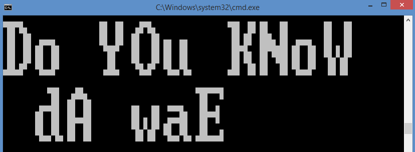

# GlyphManager
Python module that can dynamically create big terminal font (ie not hardcoded)

### About

This is a package that allows you to create, print (display), save and load "glyphs" or in other words, bitmap fonts of the windows terminal.
It is intended to be flexible and dynamic to be able to map out any font in your terminal and most importantly, to save you from hardcoding font for a project ever again (tedious and hard to maintain)!

### Output

It will produce a python dictioary with the larger bitmap rendition of each character so you can print it out with the associated function
It can also be saved to harddisk in json format by calling saveChars().

### Usage

There has already been a precompiled set of characters (A->Z, a->Z, : and " " (space)) for your convience. You may wish to create more by calling the createGlyphs function. 

You can save them by calling the saveChars() function which will add them to the character_set.txt file.
You can load characters (ie not have to create them on the spot) by calling the loadChars() funciton whic returns a dictionary of characters in the file.
With these characters you can then call BlockPrint() which takes in the message and character set (at minimum, for more arguments please see code).

NOTE: This script will not work if your font is NOT monospaced. You also need to input the width of each character. It has been hardcoded to have each character be 8 characters wide.

These are functions (in a module, but github doesnt want to add the __init__.py so you'll have to do it yourself) and thus use accordingly

### Example

Here are some examples of the output from it

### Requirements

-Python 2

-Windows (will not work in other OS)

### Credits

Thank you very much to jtriley for providing the module to find the windows terminal width!!
https://gist.github.com/jtriley/1108174
